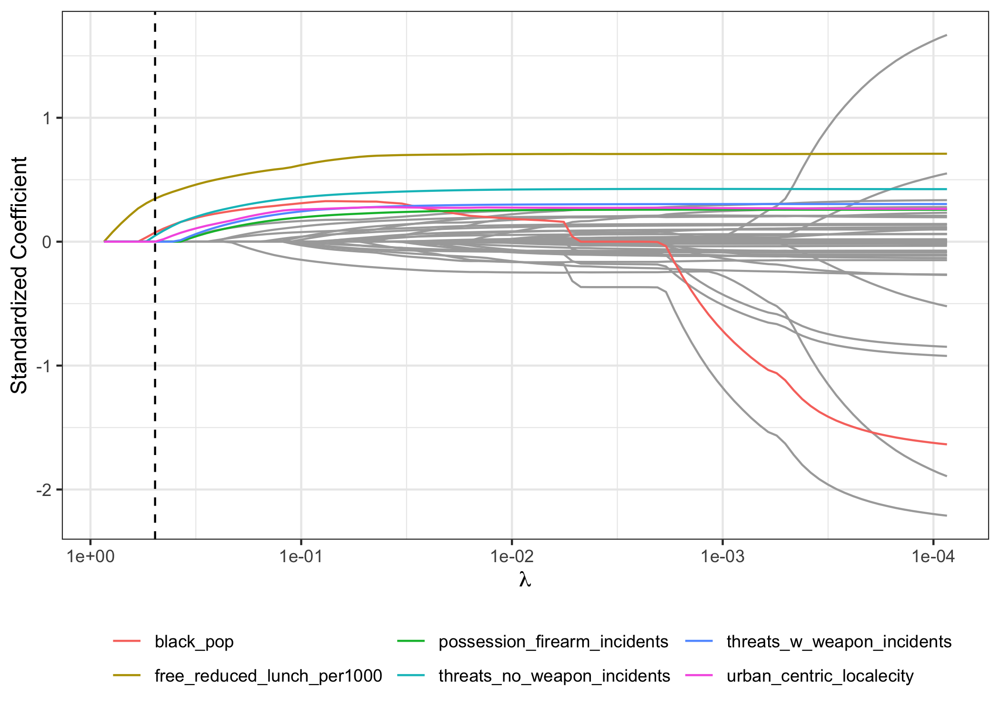

```{r setup, include=FALSE, message = FALSE}
options(scipen = 0, digits = 3)  # controls number of significant digits printed
library(tidyverse)
library(kableExtra)
```


```{r coverpage, out.width = "60%", fig.align='center', echo = FALSE, fig.pos = "H"}
knitr::include_graphics("../results/coverpage.jpg")
```

\bigskip

\newpage

# Executive Summary

**Problem.** Sandy Hook Elementary School and Santa Fe High School are synonymous with school shootings and violence. While national trends show that violence and victimization has declined from 1992 to 2017, there is a sentiment that the number of school shootings is increasing, mainly due to a steep increase in multiple-victim homicides (as opposed to single-victim homicides), revealing that the topic of school violence is still very relevant. On top of this, smaller instances of school crime are often forgotten even though they are still abundant and extremely detrimental to educational outcomes and children safety. For our final project, we decided to look into which variables were predictive of crimes and incidents of violence across US schools throughout 2015. While only analyzing 2015 school trends inherently limits the generalizability of our results, we believe the analysis draws high-level analyses about school crime trends.

**Data.** We draw from two different types of datasets: school-level data and county-level data. We used school-level data from the [Urban Institute Education Portal](https://educationdata.urban.org/documentation/schools.html#overview) to understand what school-specific features may be predictive of school crime. Using this portal, we were able to access data from: National Center for Education Statistics’ Common Core of Data (CCD), the Civil Rights Data Collection (CRDC), the US Department of Education’s EDFacts, and IPUMS’ National Historical Geographic Information System (NHGIS). Specifically, we pulled: school-level directory / geographic data, school finance data, teacher and staff data, discipline instances, and crime incidences. We used county-level data to analyze school crime macro-trends. This county-level data came from [US Economic Research Service](https://www.ers.usda.gov/data-products/county-level-data-sets/download-data/), [US Quarterly Census of Employment and wages](https://markbergen-shiny.shinyapps.io/county_data_dashboard_v2/), and [Census Bureau's Demographic data](https://data.world/bdill/county-level-population-by-race-ethnicity-2010-2019). Specifically, we pulled: unemployment, education, poverty, wage, and demographic data. Our response variable was total crime per 1,000 students enrolled. We created this variable by adding a variety of crime incidents (rape, assault, robbery, etc.) and dividing it by the schools' respective student enrollment. 

**Analysis.** Before running any analyses, we split our data into a training dataset and a testing dataset. Because of the heavily-skewed nature of our response variable, total crime incidents per 1,000 students, we square-root transformed the response, which resulted in more symmetric data. Then, on our train data, we explored our data to understand correlations between the features (through correlation plots) and between the features and the response. To understand the predictors of total crime and make a predictive model, we  built six different cross-validated models, with the end goal of selecting the best model with the best performance. Specifically, we built an OLS regression, ridge regression, Lasso regression, pruned regression decision tree, random forest, and boosting model. Regression based methods did not perform particularly well - OLS scored worse than the intercept only model, and both Ridge and Lasso, scored very similarly. Tree-based methods preformed significantly better. The pruned tree outpreformed all regerssion methods, and Random Forest and Boosting models then preformed significantly better. In the end, the optimal boosting model preformed as the best predictive model.

**Conclusions.** Throughout all models, we consistently saw similar variables surface as highly predictive of total crime. In general, we noticed that school specific variables influenced school crime much more than general demographic variables. Furthermore, key indicators such as threats and suspensions need to be taken seriously as they indicate higher levels of crime. Lastly, we were able to shine light on the importance of investing in teachers rather than psychologists, counselors and extra security guards.  


\newpage


# Introduction

**Background.** School violence has always been a part of the United States' education system. From 2017-2018, 80% of public schools recorded one or more incidents of violence, translating to a crime rate of 29 incidents per 1,000 students enrolled.^[School Crime: Fast Facts. (n.d.). https://nces.ed.gov/fastfacts/display.asp?id=49.] 
Not all recorded incidents of violence and crimes were reported to the police, suggesting that the crime rate in America's schools is even higher. While the total victimization rate and the rates of specific crimes have declined since 1992, crime rates are still high, suggesting it is very important to utilize various data sources to understand the factors that contribute to school crime. Furthermore, a thorough analysis of school crime rates and predictive factors may help inform strategies to improve school safety precautions. Establishing reliable indicators of school crime and safety are important in ensuring the safety of schools across America.

Prior research and articles have shown that school crime are influenced by a variety of factors. For example, research has shown that higher use of police in schools is associated with more school crimes.^[Gottfredson, D., Na, C., (2011). Police Officers in Schools: Effects on School Crime and the Processing of Offending Behaviors] Moreover, trends show that students residing in rural areas had higher rates of total victimization than students residing in suburban areas, suggesting crime rate differences across school geographies.^[National Center for Education Statistics. (n.d.). Indicators of School Crime and Safety: 2015. https://bjs.ojp.gov/content/pub/pdf/iscs15.pdf] Despite past research, there is much more to be learned and there is insufficient research regarding the relationship between school crime rates, school-specific features, and macroeconomic indicators. 

**Analysis goals.** Given school crime can be attributed to a variety of factors, including both school-specific variables and demographic/county-level variables, we explored how total crime rates (total crime per 1000 enrolled students) are affected by various school and demographic features. Specifically, we were interested in what kind of factors, either school-specific or county-specific, and which specific variables are most predictive in school crime rates. Some examples of school-specific features that are included in our dataset are: school type, whether the school is a charter school, how many security guards are employed, and the average teacher salary. Some examples of county-level features that we included are: the percentage of the county population that attended college, the proportion of the population that are white, and labor force participation. We built a series of regression models and tree-based models to predict school crime rates, given school-specific features and county-level features, on our training dataset, and evaluated the success of each model by comparing the model predictions to actual observed rates in our testing dataset (using RMSE). 

**Significance.** Our analysis will contribute to research regarding school crime risk factors and inform government officials or school administrators what factors are predictive of school crime. This will help support efforts to minimize school crime and improve school safety. For instance, we believe our findings can help schools allocate budgets more effectively, create systems to track possible increases in crime before they happen, or even give local goverments some direction with regard to which macroeconomic factors they should begin targeting to reduce school crime rates. 

\newpage


# Data

## Data sources

Our dataset was merged from data from the following sources: 1) [Urban Institute Education Portal](https://educationdata.urban.org/documentation/schools.html#overview), 2) [US Economic Research Service](https://www.ers.usda.gov/data-products/county-level-data-sets/download-data/), 3) [US Quarterly Census of Employment and wages](https://markbergen-shiny.shinyapps.io/county_data_dashboard_v2/), and 4) [Census Bureau's Demographic data](https://data.world/bdill/county-level-population-by-race-ethnicity-2010-2019). Each data source includes multiple years of data, and we chose to focus on 2015 data since there were the most number of available features for that year.

The data regarding school-specific features came from the [Urban Institute Education Portal](https://educationdata.urban.org/documentation/schools.html#overview). The data from the portal was pulled from a variety of sources, including the National Center for Education Statistics' CCD, the CRDC, the US Department of Education's EDFacts, and IPUMS' NHGIS. In order to ensure a wide range of explanatory variables in our dataset, we pulled 2015 variables across the following categories: school directory, demographic, finance, teacher and staff, and discipline data, in addition to our response variable, which came from the criminal data. The data was specially pulled using the "educationdata" library provided. After pulling these datasets, we merged the variables into a final dataset by each school's National Center for Education Statistics (NCES) identification number (a unique school identifier).

Because we were also interested in broader demographic data, we drew from various government and census datasets, including: [US Economic Research Service](https://www.ers.usda.gov/data-products/county-level-data-sets/download-data/), [US Quarterly Census of Employment and Wages](https://markbergen-shiny.shinyapps.io/county_data_dashboard_v2/), and [Census Bureau's Demographic data](https://data.world/bdill/county-level-population-by-race-ethnicity-2010-2019). The US Economic Research Service provided county-level unemployment, educational attainment, and poverty rates The unemployment and educational attainment rates were recorded from 2000 to 2020, and the only poverty estimates available were from 2019. Because the rest of our data is of 2015, we assume that poverty estimates from 2015 are reasonably similar to those from 2019. We extracted data from 2015 in the unemployment and educational attainment data and the 2019 poverty estimates for our data analysis. The US Quarterly Census of Employment and Wages had average wages for each county since 1990 - we selected 2015 directly from the dashboard's UI. Lastly, the Census Bureau's demographic data had total populations, as well as different race populations for each county from 2010 to 2019. Again, we filtered for only 2015. We merged the variables into a final dataset by each county's unique FIPS code. 

## Data cleaning

For data cleaning, we started by examining each dataset in depth to determine which features and observations to keep. 

In the school-specific datasets, we first transformed all negative values to NA values, since negative values imply that the data was missing/not reported, not applicable or not interpretable, per the Education Data Portal. Then we dropped all features that had more than 85% `NA` values, and dropped repeat observations and observations with any `NA` feature values. We dropped `NA` values for consistency purposes, as many of the data mining methods we employed require that all variables be populated with non-NA fields. In the directory dataset, one important feature is the degree of urbanization (urban-centric locale) of the school, which was coded with 12 levels, so we collapsed the categorical variable into 4 broader levels, including city, suburb, town, and rural. After cleaning each individual dataset, we merged the school-specific sets by the schools' unique NCES identification number. 

For the macro-level county datasets, we first filtered the data to include only 2015 data (except poverty estimates because 2015 data was not available). We renamed variables for clarity and computed various race metrics as a percentage of population for comparability purposes. Each school is associated with a county-specific FIPS code and the macro-level county data includes observations for each county, which allowed us to merge in the macro-level county data in with the school-specific data, resulting in our final dataset that we used for analysis.

## Data description

### Observations

Our cleaned and merged final dataset has a total of 66,694 observations, corresponding to each of the schools included in our analysis.

### Response Variable

Our response variable is the number of crimes per 1000 students enrolled (square root transformed). We created our response variable by summing rape incidents, sexual battery incidents, robberies and attacks to get a high level variable that captured crime rates. We also transformed the total crime figure to be per 1000 students enrolled (by dividing by the school's enrollment and then multiplying by 1000), to improve comparability of schools on a 'per student enrolled' basis as it inherently controls for school size variability. Then we square root transformed the response to obtain a more "symmetric" variable. 

### Features

We included 45 explanatory variables in our analysis, which fall into two broad categories: school-specific factors and macro/county-level factors. For a detailed specification of these variables, refer to Appendix \@ref(appendix).

## Data allocation

After data cleaning, we split our dataset into a training dataset and a testing dataset. We used an 80-20 split, such that the training set consists of 80% of the observations and the testing set consists of the other 20% of the observations. The training dataset was used for building our predictive models and the testing dataset was used for model evaluation. 

## Data exploration

### Response

We first explored the response variable's distribution. As seen in the histogram of total crimes per 1000 students variable (left plot of Figure \@ref(fig:response-histogram)). The histogram is very right-skewed, indicating that the dataset contains a number of outliers with extremely high crime rates. The mean is 19.3 crimes per 1000 enrolled students. To account for this, we square root transformed the response variable, which resulted in a distribution shown in the right plot of Figure \@ref(fig:response-histogram). For our analyses and model building, we used the transformed response.

```{r response-histogram, fig.width = 6, fig.height = 5, out.width = "90%", fig.cap = "Distribution of Crime Rate (vertical dashed line indicates the mean)", fig.align='center', echo = FALSE, fig.pos = "H"}
knitr::include_graphics("../results/response-hist-both.png")
```
We proceeded to determine which schools had extreme response rates by looking at the sorted data. The sorted data (Table \@ref(tab:top-10-schools)) shows that Maple Lane School had the highest crime rate by far, more than double the second highest ranked school. Further research shows that Maple Lane School was a juvenile corrections facility that closed in 2010, indicating that the observation should not be in the dataset to begin with.^[Turn Maple Lane into prison center? Allen, Marqise. https://www.theolympian.com/news/local/article25274248.html] To account for this, we dropped Maple Lane School from the training set.

```{r top-10-schools, message = FALSE, echo = FALSE}
read_tsv("../results/top-10-schools-data.tsv") %>%
  kable(format = "latex", row.names = NA, 
        booktabs = TRUE, digits = 2, 
        col.names = c("School", "Crimes per 1000 Students"),
        caption = "Top Ten Schools By Crime Rate") %>%
  kable_styling(position = "center", latex_options = "HOLD_position")
```

### Features

Next, we explored high-level relationships and correlations of the predictor variables with the response variable. We first looked at correlations between a few school-specific features, as shown in Figure \@ref(fig:school-corrplot). We observe a positive correlation between the number of full-time equivalent teachers and the number of full-time equivalent security guards as well as teacher salaries. We also a negative correlation between the number of full-time equivalent teachers and the number of students enrolled in free or reduced lunch. Moreover, there is a negative correlation between teacher salaries and the number of students enrolled in free or reduced lunch. 

```{r school-corrplot, out.width = "60%", fig.cap = "School-Specific Features Correlation Plot", fig.align='center', echo = FALSE, fig.pos = "H"}
knitr::include_graphics("../results/school-corrplot.png")
```

We also looked at correlations between some county-level features, as shown in Figure \@ref(fig:county-corrplot). In general, county-level data exhibited much more multicollinearity. Many of these variables are directly related (the rates of college completion is negatively correlated with the rates of individuals who only completed high school). Other variables had obvious relationships, such as the rate of individuals who did not complete high school correlating negatively with household income and positively with unemployment; or rates of college completion correlating with household income. Another notable relationship was the negative correlation between white and black populations, which demonstrates that, to this day, American counties are still extremely segregated.

```{r county-corrplot, out.width = "60%", fig.cap = "County-Level Features Correlation Plot", fig.align='center', echo = FALSE, fig.pos = "H"}

```

We also examined correlations across the different categories of variables (both school-specific and county-level) as shown in Figure \@ref(fig:county-school-corrplot). Once again, we observe a number of expected correlations (i.e. high rates of minors living in poverty is heavily correlated the rate of students enrolled in free/reduced lunch programs). Moreover, some relationships between a county's economic data and school resources began to emerge (i.e. higher poverty rates are correlated with lower teacher salaries). It was interesting to see that suspensions and number of threats did not correlate with any of the county-level socio-demographic factors. This analysis shows that the county-level macro data does have a direct impact on some of the resources of a school (i.e. teacher salary) but not necessarily on certain crime or disciplinary factors. 

```{r county-school-corrplot, out.width = "75%", fig.cap = "School-Specific and County-Level Features Correlation Plot", fig.align='center', echo = FALSE, fig.pos = "H"}

```

For further analysis, we explored how three variables (total poverty, unemployment, and threats) related to our response variable (total school crime) as an initial indicator to possible models. We did this by plotting scatterplots with our train data, along with a linear regression line to further illustrate the relationship, as seen in Figure \@ref(fig:scatterplots1). By inspection, threats with firearms or explosives, poverty rates, and unemployment rates were all positively correlated with crime rates. However, the relationship between threats and crimes is much stronger than the relationship between poverty / unemployment and crimes.   

```{r scatterplots1, out.width = "100%", fig.cap = "Crimes and Poverty Scatter Plot", fig.align='center', echo = FALSE, fig.pos = "H"}

```
We also explored how school type was related to school crimes. By inspection of Figure \@ref(fig:box1), there are significant outliers for each of the three types of schools, but the maximum for special education schools is the highest. The maximum crime rate out of all vocational schools was the lowest. 
```{r box1, out.width = "90%", fig.cap = "Crimes and School Type Box Plot", fig.align='center', echo = FALSE, fig.pos = "H"}

```
\newpage

# Modeling

## Regression-based methods

### Ordinary least squares

As a starting point, we built an ordinary least squares regression with all 45 explanatory variables. However, when considering the normality assumptions, we note that our response distribution, even after applying a square root transformation, is not normally distributed. Moreover, as demonstrated in our correlation plots, many of the features are correlated. Extended results are reported in the Appendix \@ref(appendix2) (Figure \@ref(fig:olsSummary)). The R-squared of the regression was 0.144, signifying a rather weak relationship between the model and the response. We believe that severe skew in our data and multicollinearity between our predictor variables decreased the accuracy of our model.

However, there were a number of significant variables, including: the urbanization of the school location, a variety of quantity teacher metrics, the amounts of threats each school was reported with, race demographic data, and almost all economic data (unemployment, poverty, weekly wage, etc.).

### Penalized regressions

Despite identifying significant variables from the ordinary least squares regression, the method utilized all of 45 explanatory variables (with high intercorrelations), which could lead to a cost in variance, and thus inaccurate predictions. To combat these issues, we built and evaluated shrinkage models, namely ridge regression and lasso regression, with the goal of fitting a more parsimonious and interpretable model.^[Note: we did not display elastic net results because the elastic net selected an $\alpha$ value of 1, which reduces to the lasso regression] Specifically, ridge regression is more stable when handling correlated features, as it "splits the credit" among correlated features, and lasso regression penalizes many features to 0, contributing to increased interpretability. For both penalized regression methods, we ran a 10-fold cross validation to optimize the choice of regularization parameters ($\lambda$).

```{r ridgecv, out.width = "80%", fig.cap = "Cross Validation for Ridge Regression", fig.align='center', echo = FALSE, fig.pos = "H"}
#
```
```{r lassocv, out.width = "80%", fig.cap = "Cross Validation for Lasso Regression", fig.align='center', echo = FALSE, fig.pos = "H"}
#knitr::include_graphics("../results/lasso-cv-plot.png")
```

The lasso regression trace plot is shown in Figure \@ref(fig:lasso-trace-plot) and the selected features and respective coefficients are displayed in Table \@ref(tab:lasso-coefficients). We applied the one standard error rule to select the optimal $\lambda$ value, and we notice that the lasso regression selects three variables: the number of students receiving free or reduced lunches per 1000 enrolled students, the proportion of the county population that identifies as black, and the amount of non-weapon threats a school receives. 

```{r lasso-coefficients, message = FALSE, echo = FALSE}
read_tsv("../results/lasso-features-table.tsv") %>%
  kable(format = "latex", row.names = NA, 
        booktabs = TRUE, digits = 2, 
        col.names = c("Feature", "Coefficient"),
        caption = "Standardized coefficients for features in the lasso 
        model based on the one-standard-error rule.") %>%
  kable_styling(position = "center", latex_options = "HOLD_position")
```

```{r lasso-trace-plot, out.width = "90%", fig.cap = "Lasso Regression Trace Plot", fig.align='center', echo = FALSE, fig.pos = "H"}

```

[ why is this here ]
Following, in \@ref(tab:regression-eval) are the results for tree based methods:

```{r regression-eval, message = FALSE, echo = FALSE}
read_tsv("../results/model-evaluation-regression.tsv") %>%
  kable(format = "latex", row.names = NA, 
        booktabs = TRUE, digits = 2, 
        col.names = c("Method", "Test RMSE (transformed)", "Test RMSE"),
        caption = "RMSE summary for regression methods") %>%
  kable_styling(position = "center", latex_options = "HOLD_position")
```

## Tree-Based Methods

### Ordinary pruned tree

In addition to regression methods, we also implemented tree-based methods to capture possible non-linear relationships between the features and the response. We began our tree-based modeling by prediction via a traditional decision tree, which offers the benefit of high interpretability. We selected the complexity of the decision tree based on cost complexity pruning and cross-validation. The cross-validation plot compared to the number of terminal nodes is displayed in Figure \@ref(fig:treecv). Based on the one-standard-error rule, we chose 6 terminal nodes. 

````{r treecv, out.width = "60%", fig.cap = "Decision Tree: Cross Validation for Terminal Nodes", fig.align='center', echo = FALSE, fig.pos = "H"}

```

To obtain the optimal pruned tree, we specified the chosen complexity parameter and applied cost complexity pruning. This results in the decision tree displayed in Figure \@ref(fig:optimaltree). The path that leads to the greatest prediction of the square root transformed total crimes per 1000 enrolled students response is: the school experienced 1 or more no-weapon threats, more than 24 average student suspensions, and more than 638 students out of 1000 enrolled students receiving free or reduced price lunch. Logically, this path makes sense as more threats and more student suspensions are typically associated with unsafe school conditions, and more students enrolled in free or reduced priced lunches indicates a poorer county, which can be subject to higher crime rates.

````{r optimaltree, out.width = "80%", fig.cap = "Pruned Decision Tree", fig.align='center', echo = FALSE, fig.pos = "H"}

```

### Random forest

In order to improve the predictions from the individual tree, we proceeded to fit a random forest, which involves growing deep decision trees in parallel. Bagging is achieved when considering all 45 features at each split point of the tree, which leads to high variance and inaccurate prediction performance. To account for this, when tuning the random forest, we optimized both the number of bootstrap samples, corresponding to the number of trees, ($n$), and the number of variables to sample at each split point ($m_{try}$). Because of the computation costs of random forests and computer issues, we trained it on 5,000 observations of our train data. 

First we trained a random forest with default settings, and visualized the fit displayed in Figure \@ref(fig:rfnumtrees), which plots the OOB error as a function of the number of trees. By inspection, the error flattens out as soon as the number of trees is large enough (in this case, the error stabilizes around 200 trees).


````{r rfnumtrees, out.width = "60%", fig.cap = "Default Random Forest OOB Error vs. Number of Trees", fig.align='center', echo = FALSE, fig.pos = "H"}

```

For the purpose of tuning $m_{try}$, we select 500 trees. We tune $m_{try}$ using a systematic approach by choosing a grid of values of $m_{try}$ and plotting the OOB error for 500 trees. Specifically, we trained the model using $m_{try}$ values ranging from 1 to 30. The OOB error for each value of $m_{try}$ is visualized in Figure \@ref(fig:mtune). By observation, the OOB error is minimized at a value of $m_{try} = 11$. After reaching a minimum at this value, the OOB error begins to exhibit overfitting as it begins to trend upward. 

````{r mtune, out.width = "60%", fig.cap = "Tuned Random Forest OOB (m = 11)", fig.align='center', echo = FALSE, fig.pos = "H"}

```

Because we do not explicitly tune $n$, or the number of trees, we simply select the largest value, which is $n=500$. Then, we fit the random forest using $n=500$ and $m_{try} =11$. We then plotted the variable importance using the two types of variable importance, purity-based and OOB-based variable importance. The results from both of these variable importance measures is given in Figure \@ref(fig:rfimportance). By inspection, we observe that the number of no-weapon threats and the number of average suspensions of a school have the highest importance as measured by both the purity-based and OOB-based metrics. The proportion of the population that identifies as black, the proportion of the population that identifies as white, and the number of teachers in the previous school year are also variables that are important. This suggests that these variables are the most important in predicting total crimes across different schools in America.

````{r rfimportance, out.width = "80%", fig.cap = "Tuned Random Forest Variable Importance", fig.align='center', echo = FALSE, fig.pos = "H"}

```

### Boosting

In addition to the random forest model, we also implemented a gradient boosting model, which is another method of aggregating multiple decision trees to improve prediction performance over a traditional decision tree. Boosting grows shallow decision trees sequentially, by considering a low-complexity weak learner (a shallow decision tree) and boosting the performance of the weak learning by applying an iterative method. For our first boosting model, we used default parameters (500 trees, an interaction depth of 1, and a shrinkage of 0.1). To tune this model, we adapted both the depth of each individual 'weak-learner' (interaction depth) and the number of 'weak-learners' (number of trees) used per model. After noticing that using a number of trees between 500 and 1000 was optimal, we tuned the interaction depth by testing interaction depth levels of 1, 2, and 3. By inspection of the cross-validation plot shown in Figure \@ref(fig:boostingtuning), we see that an interaction depth of 3 offers the lowest cross-validation error. Specifically, the cross-validation error reaches its minimum with 518 trees. 

````{r boostingtuning, out.width = "75%", fig.cap = "Boosting Tuning Interaction Depth and Number of Trees", fig.align='center', echo = FALSE, fig.pos = "H"}
knitr::include_graphics("../results/interaction_depth_tuning.png")
```

With the tuned boosting model using 518 trees and an interaction depth of 3, we judged variable importance by comparing purity-based importance. The ranking of variables based on purity-based importance is given in Table \@ref(tab:boosting-coefficients). Similar to the random forest method, the number of suspensions and the number of no-weapon threats rank high in terms of variable importance. 

```{r boosting-coefficients, message = FALSE, echo = FALSE}
read_tsv("../results/top-10-features-boosting.tsv") %>%
  kable(format = "latex", row.names = NA, 
        booktabs = TRUE, digits = 2, 
        col.names = c("Feature", "Coefficient"),
        caption = "Boosting top 10 most important features based on purity score") %>%
  kable_styling(position = "center", latex_options = "HOLD_position")
```

In addition, we also examined partial dependence plots of average suspensions and the number of no-weapon threats, which are the two most important features, as shown in Figure \@ref(fig:pdp1). It is important to remember that because our tuned boosting model uses an interaction depth of 3, they are simply an approximation for illustrative purposes, but they nonetheless give a good representation of how each variable affects total crime. Taken together, Figure \@ref(fig:pdp1) suggests that schools that suspend more students and face more no-weapon threats face disproportionately higher crime rates.s

````{r pdp1, out.width = "80%", fig.cap = "Average Suspensions and No-Weapon Threats Partial Dependence Plots", fig.align='center', echo = FALSE, fig.pos = "H"}

```

```{r tree-evaluation, message = FALSE, echo = FALSE}

read_tsv("../results/model-evaluation-tree.tsv") %>%
  kable(format = "latex", row.names = NA, 
        booktabs = TRUE, digits = 2, 
        col.names = c("Method", "RMSE (Transformed)", "RMSE"),
        caption = "RMSE summary for Tree based methods") %>%
  kable_styling(position = "center", latex_options = "HOLD_position")
```

# Conclusions

## Method comparison

```{r model-evaluation, message = FALSE, echo = FALSE}
read_tsv("../results/model-evaluation-total.tsv") %>%
  kable(format = "latex", row.names = NA, 
        booktabs = TRUE, digits = 2, 
        col.names = c("Method", "RMSE"),
        caption = "RMSE Summary for All Methods") %>%
  kable_styling(position = "center", latex_options = "HOLD_position")
```

Table \@ref(tab:model-evaluation) displays the test RMSE (untransformed) for all the methods considered. Based on RMSE, the random forest and boosting methods have the lowest test errors. This is reasonable given these models’ tendencies to have high predictive accuracy. Between the two, the boosting model has the lowest test error of 52.3 crimes per 1000 students, but its accuracy is comparable to the random forest method, which has a test error of 53.8 crimes per 1000 students. Notably, the tree-based methods perform better than the regression-based methods, namely OLS, a predictor that simply predicts the mean crime rate of the training set, ridge regression, and lasso regression. This ultimately points to the idea that the relationship between the response and the explanatory variables is not necessarily linear. There are certain school that have un-proportionally high crime becasue of idiosyncratic reasons, whereas there are many that have no crime at all. This may explain why the tree-based methods outperformed the regression-based methods.

While we observe improved predictive performance across tree-based methods relative to regression-based methods, it is worth mentioning that the predictive performance across all fitted models is quite poor. This is likely explained by the idea that most of the variation in the data is random and not explainable by the selected predictor variables. Moreover, it could be that the dataset is not robust enough, in that there were a number of misreported values and observations, as evidenced by the inclusion of Maple Lane School, which is not a school and closed in 2010 (which we subsequently dropped in the training sets). 

Regardless of the test errors, all of the models overlap when considering important features. For example, the top features for the lasso regression included: the number of students receiving free/reduced priced lunch per 1000 enrolled students, the proportion of the population that identified as black, and the number of no-weapon threats. In the simple decision tree, we see that the first split point is the number of no-weapon threats, and a subsequent split point is based on the number of students receiving free/reduced priced lunch. Moreover, we see no-weapon threats and the black population are very important features in the random forest and boosting model as measured by the features' contribution to node purity. 

## Takeaways

Even though our models exhibited rather poor predictive performance, we identified a few important explanatory variables when considering school crime. Our analysis points to a few key results that policymakers and government officials should consider when aiming to reduce crime rates in schools. Note that in our analysis, we interpret crimes as violence incidents committed both by students and by non-students

1. As seen by our regression tree, random forest, and boosting model, school-specific features were more important predictors than county-level features. Although many macro variables (unemployment, poverty, low adult education) did correlate with school crime, these factors became less relevant when accounting for school-specific variables. We believe this is a sign that although schools may be located in a more impoverished county, factors such as sufficient funding (evidenced through the variable importance of non-personnel expenditures that go towards enhancing a school's learning environment) and higher teacher salaries teachers (to attract higher quality teachers) can help the school beat its precarious circumstances. In other words, school-specific factors, such as funding and teachers, can help create a safe school environment and discourage student violence, making the environment less prone to crimes.

2. Across a number of our models, the proportion of a county that identifies as black is a key explanatory model, which should be of great interest to local governments. Across a variety of research, all kinds of data repeatedly show that minority and marginalized communities are disproportionately negatively affected by events like recessions and pandemics the most, and thus idea translates to school violence and crime as well as shown through our data analysis. Thus, we believe that local government should recognize inequalities in race when allocating funds.

3. In our regression tree, random forest, and boosting model, the number of suspensions is a key feature. We believe the department of education should investigate this phenomenon more. There may be reverse causation at play, namely, a lot of crime results in higher suspension rates. However, there are many research studies that corroborate that suspensions may actually be causing worse behavior such as [this National Association of School Psychologists article](https://www.nassp.org/publication/principal-leadership/volume-22-2021-2022/principle-leadership-october-2021/suspension-is-not-the-answer/), or [this National Education Association article](https://www.nea.org/advocating-for-change/new-from-nea/school-suspensions-do-more-harm-good), both of which explain how suspension creates a vicious cycle: antagonizing students, sending them away school to school which often lead to long-periods of unsupervised time, more crime upon returning to school, and a subsequent suspension. Reform on this traditional reprimand method could be a cost-free method of greatly reducing crime rates.

4. In several analysis, we identified teacher salaries and non-personnel expenditures to be important school-specific features, which signals that schools should be increasing allocated funds towards paying teacher salaries and enhancing the learning environment. Variables such as the number of security guards and number of administrative staff (that do not directly impact a students learning environment) did not prove to be important in any of our models. This ultimately shows that school boards should take this into consideration when allocating budgets.  


## Limitations

### Dataset limitations

Because we based our analysis in 2015 school and county data, it is possible that the values of the variables assessed drastically changed in 2021, meaning that the interpretation of our analysis and of the variable importances cannot be directly extrapolated to other years. Moreover, given that we analyzed data on the county-level, it is possible that counties experienced drastic changes over the past 5 years. For example, a study by the World Economic forum^[Rapid urbanization and rural decline – the 2 trends redefining US demographics, (n.d.). https://www.weforum.org/agenda/2020/01/growth-and-decline-visualizing-u-s-population-change-by-county] showed that half of the country's coal miners are concentrated in 25 American counties, suggesting that as coal mines close with the changing domestic energy references, the state of these counties, in terms of poverty and work force participation, may have drastically changed. Regardless, we believe it is unlikely that any county experienced an aggregate change drastic enough to significantly affect our analysis. 

Additionally, during our exploration of the data, we noted that there is evidence of correlation among some of the explanatory variables in the dataset, as evidenced by our correlation plots. This implies that some variables are confounding variables that influence both the dependent variable and independent variable, causing a spurious association. This ultimately could affect the interpretability of our model analyses. 

Moreover, because of the models employed in the project, we had to remove a number of school observations from the dataset. In other words, because each observation represents a different US school, many schools were left out of the analysis, which limits the usability of the data. It is possible that the data covers only one or two conditions of a larger set that we tried to model. For example, extremely poor schools lacking sufficient administrative staff may have not reported school-specific values, causing us to have dropped all of these poor school observations from the dataset. Additionally, because a significant portion of the dataset comes from different school surveys, it is important to recognize that not all schools accurately report information and the data collected across multiple sources includes duplicate records and inconsistencies, which questions the validity and reliability of the dataset.

### Analysis limitations

As a result of the survey-based nature of the dataset, it is very possible that data included in our analysis is not robust and reliable, which introduces uncertainty into our analysis. Notably, the data includes very extreme outlier values, which we maintained in the dataset (with the exception of Maple Lane School, which is a juvenile detention facility). To illustrate, the distribution of the crimes per 1000 students is as follows: the minimum and first quartile is 0, median is 0, mean is 19, third quartile is 14, and the maximum is 12458. While a school recording 12,458 crimes per 1000 enrolled students seems highly unlikely, it is possible. Ultimately, the reliability of the dataset could explain the poor predictive performance of all of our models.

Moreover, the splitting of the data into a training and testing dataset introduces elements of randomness. For example, using a different subset of observations in the training set could lead to different selected variables in the penalized regression methods and different variable importances in the tree-based methods. 

Next, computational limitations forced us to use a subset of 5,000 schools to train and cross-validate our Boosting and Random Forest models. Being able to use the enitre training dataset would have allowed our forest and boosting models to improve. This could be done by implementing a variety of big-data tecniques.  

Lastly, although we tried to provide a comprehensive set of school-related and county-related variables, our analysis only incorporates a specific subset of these types of features, and thus the analysis could change in the presence of additional variables. For example, research has identified parent criminality, child maltreatment, academic failure, and gang involvement as key risk factors for school violence.^[Risk Factors for School Violence, (n.d.). https://www.pcsb.org/page/3670] We did not use such variables in our analysis, and the incorporation of such features may result in better predictive performance.

## Follow-ups

To account for the dataset and analysis limitations, we recommend further data analysis using data from more recent years and a more extensive set of explanatory variables. In addition to extending the analysis using the most up-to-date data and more features, we can also fine tune the analysis by focusing on predicting specific kinds of crime. For example, there is data about the number of school shootings and the number of sexual assaults. In other words, using a more fine tuned response variable could reveal important school-level and county-level factors. Lastly, because we omitted several observations due to missing and incomplete data, we recommend the analyses be replicated once the missing data is collected. 

\appendix

# Appendix: Descriptions of features {#appendix}

Below are the 45 features we used for analysis. Words written in parentheses represent variable names. Unless noted otherwise, all variables are continuous. 

**School-Specific Variables:** 

- *Geography*
  - Urbanization (`urban_centric_locale`): Factor variable representing the degree of urbanization. Factors include schools located in: cities, rural areas, suburbs, and towns.
- *School Attributes* 
  - School type (`school_type`): Factor variable representing the school type. Factors include: regular schools, special education schools, and vocational schools. 
  - Charter school (`charter`): Binary variable representing whether the school is a charter school (1) or not a charter school (0). 
  - Students eligible for free or reduced-price lunch (`free_reduced_lunch_per1000`): Number of students eligible for free or reduced-price lunch per 1000 enrolled students.
- *Teacher and Staff*
  - Full-time equivalent teachers (Civil Rights Data Collection) (`teachers_fte_crdc`): Number of full-time equivalent teachers.
  - Full-time equivalent certified teachers (`teachers_certified_fte`): Number of full-time equivalent certified teachers.
  - Full-time equivalent uncertified teachers (`teachers_uncertified_fte`): Number of full-time equivalent uncertified teachers.
  - Full-time equivalent first-year teachers (`teachers_first_year_fte`): Number of full-time equivalent first-year teachers.
  - Full-time equivalent second-year teachers (`teachers_second_year_fte`): Number of full-time equivalent second-year teachers.
  - Current school year teachers (`teachers_current_sy`): Number of current school year teachers.
  - Previous school year teachers (`teachers_previous_sy`): Number of previous school year teachers.
  - Full-time equivalent teachers absent more than 10 school days (`teachers_absent_fte`): Number of full-time equivalent teachers absent more than 10 school days
  - Full-time equivalent school counselors (`counselors_fte`): Number of full-time equivalent school counselors.
  - Full-time equivalent psychologists (`psychologists_fte`): Number of full-time equivalent psychologists.
  - Full-time equivalent social workers (`social_workers_fte`): Number of full-time equivalent social workers.
  - Full-time equivalent nurses (`nurses_fte`): Number of full-time equivalent nurses.
  - Full-time equivalent security guards (`security_guard_fte`): Number of full-time equivalent security guards.
  - Sworn law enforcement officers indicator (`law_enforcement_ind`): Indicator of whether a sworn law enforcement officer has been assigned to the school.
  - Teacher salaries (`salaries_teachers`): Personnel salaries at school level (teachers only) amount.
- *School Finance*
  - Non-personnel expenditures (`expenditures_nonpersonnel`): Amount of non-personnel expenditures. May include: professional development for teachers, computers, library books, and other learning materials.  
- *Criminal Activity*
  - Threats of physical attack with a weapon (`threats_w_weapon_incidents`): Number of incidents of threats of physical attack with a weapon.
  - Threats of physical attack with a firearm or explosive device (`threats_w_firearm_incidents`): Number of incidents of threats of physical attack with a firearm or explosive device.
  - Threats of physical attack without a weapon (`threats_no_weapon_incidents`): Number of incidents of threats of physical attack without a weapon.
  - Possession of a firearm or explosive device (`possession_firearm_incidents`): Number of incidents of possession of a firearm or explosive device.
- *School Discipline*
  - Suspensions (`avg_suspensions`): Number of student suspensions.

**County-Level Variables:**

- *Education Variables*
  - Percent of adults without higschool (`perecent_no_highschool`): Percentage of adults that do not have a higschool diploma for a specific county
  - Percent of adults with highschool diploma but did not begin college (`percent_only_highschool`) for a specific county
  - Percent of adults with some college (`perecent_some_college`): Percentage of adults that have a highschool diploma, and started (but did not complete) college education for a specific county
  - Percent of adults with college (`perecent_all_college`): Percentage of adults that have a college degree for a specific county
- *Employment Statistics*
  - Civilian labor force (`Civilian_labor_force_2015`): How many civilians are working in the labor force (both employed and unemployed). 
  - Unemployment rate (`Unemployment_rate_2015`): the unemployment rate for a county
  - Labor force participation (`labor_force_participation`): (employed + unemployed) divided by population
- *Demographics*
  - Population (`pop`): total county population
  - Percent white (`white_pop`): percentage of a county that identifies as white
  - Percent black (`black_pop`): percentage of a county that identifies as black
  - Percent asian (`asian_pop`): percentage of a county that identifies as asian
  - Percent indian (`indian_pop`): percentage of a county that identifies as indian
  - Percent hispanic (`hisp_pop`):  percentage of a county that identifies as hispanic
- *Poverty*
  - General poverty rate (`Poverty_all_population`):percentage of county living in poverty  
  - Minor poverty rate (`minor_poverty`): percentage of minors (0-18 years) in county living in poverty 
  - School-age poverty rate (`percent_school_age_children_poverty`): percentage of school age children (5-18 years) in county living in poverty 
- *Income*
  - Household Income (`Household_income`): Average yearly annual income earned by a household
  - Weekly Wage (`avg_wkly_wage`): The average weekly wage paid by employers in a county  

# Appendix: OLS Regression Summary {#appendix2}

```{r olsSummary, out.width = "90%", fig.cap = "OLS Coefficient Summary", fig.align='center', echo = FALSE, fig.pos = "H"}

```


  