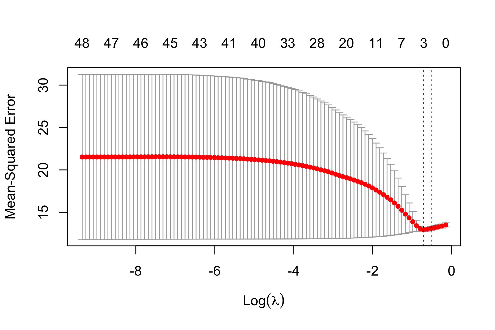

```{r setup, include=FALSE, message = FALSE}
options(scipen = 0, digits = 3)  # controls number of significant digits printed
library(tidyverse)
library(kableExtra)
```


```{r coverpage, out.width = "60%", fig.align='center', echo = FALSE, fig.pos = "H"}

```

\bigskip

\newpage

# Executive Summary

**Problem.** Sandy Hook Elementary School and Santa Fe High School are synonymous with school shootings and violence. While national trends show that violence and victimization has declined from 1992 to 2017, there is a sentiment that the number of school shootings is increasing, mainly due to a steep increase in multiple-victim homicides (as opposed to single-victim homicides), revealing that the topic of school violence is still very relevant. On top of this, smaller instances of school crime are often forgotten even though they are still abundant and extremely detrimental to educational outcomes and children saftey. For our final project, we decided to look into which variables were predictive of crimes and incidents of violence across US schools throughout 2015. While only analyzing 2015 school trends inherently limits the generalizability of our results, we believe the analysis draws high-level analyses about school crime trends.

**Data.** We draw from two different types of datasets: school-level data and county-level data. School-level data from the [Urban Institute Education Portal](https://educationdata.urban.org/documentation/schools.html#overview) was used to see what school-specific features may be predictive of school crime. Using this portal, we were able to access data from: National Center for Education Statistics’ Common Core of Data (CCD), the Civil Rights Data Collection (CRDC), the US Department of Education’s EDFacts, and IPUMS’ National Historical Geographic Information System (NHGIS). Specifically, we pulled: school-level directory / geographic data, school finance data, teacher and staff data, discipline instances, and crime incidences. Our county-level data was to analyze any macro-trends that predict school crime. This county level data came from [US Economic Research Service](https://www.ers.usda.gov/data-products/county-level-data-sets/download-data/) (for unemployment, education, and poverty rate estimates), [US Quarterly Census of Employment and wages](https://markbergen-shiny.shinyapps.io/county_data_dashboard_v2/)(for wage data), and [Census Bureau's Demographic data](https://data.world/bdill/county-level-population-by-race-ethnicity-2010-2019) (for general population demographic data). Our response variable was total crime per 1,000 students enrolled. We created this variable by adding a variety of crime incidents (rape, assault, robery, etc.) and dividing it by the respecitve school enrollment. 

All macro-data was at the county-level, each row having a unique County FIPS code. This FIPS code was used to match to each shcool's FIPS code. 

**Analysis.** Before running any analyses, we split our data into a training dataset and a testing dataset. Because of the heavily-skewed nature of our response variable, total crime incidents per 1,000 students, we square-root transformed the response, which resulted in more symmetric data. Then, on our train data, we explored our data to understand correlations between variables and the response. We also plotted correlation matrices to understand how our predictor variables interacted with each other. To understand the predictors of total crime and make a predictive model, we  built five different cross-validated models, with the end goal of selecting the best model with the best performance. Specifically, we built a ridge regression, Lasso regression, pruned regression decision tree, random forest, and boosting model. Both penalized regression models gave similar RMSEs, with the Lasso method yielding slightly better predictions. Of the tree-based models, the random forest and boosting model greatly outperformed the regular regression decision tree. The Random Forest had the lowest test error of the tree-based models, and served as the best predictive model overall.

**Conclusions.** Throughout all models, we consistently saw similar variables surface as highly predictive of total crime. In general, we saw FINISH


\newpage


# Introduction

**Background.** Sadly, school violence has always been a part of the United States' education system. From 2017-2018, 80% of public schools recorded one or more incidents of violence, translating to a crime rate of 29 incidents per 1,000 students enrolled.^[School Crime: Fast Facts. (n.d.). https://nces.ed.gov/fastfacts/display.asp?id=49.] 
Not all recorded incidents of violence and crimes were reported to the police, suggesting that the crime rate in America's schools is even higher. While the total victimization rate and the rates of specific crimes have declined since 1992, crime rates are still high, suggesting it is of vital importance to utilize various data sources to understand the highest risk factors for school crimes. Furthermore, a thorough analysis of school crime rates and predictive factors may help inform strategies to improve school safety precautions. Establishing reliable indicators of school crime and safety are important in ensuring the safety of schools across America.

Prior research and articles have shown that school crime are influenced by a variety of factors. For example, research has shown that higher use of police in schools is associated with more school crimes.^[Gottfredson, D., Na, C., (2011). Police Officers in Schools: Effects on School Crime and the Processing of Offending Behaviors] Moreover, trends show that students residing in rural areas had higher rates of total victimization than students residing in suburban areas, suggesting crime rate differences across school geographies.^[National Center for Education Statistics. (n.d.). Indicators of School Crime and Safety: 2015. https://bjs.ojp.gov/content/pub/pdf/iscs15.pdf] Despite past research, there is much more to be learned and there is insufficient research regarding school crime rates, school-specific features, and macroeconomic indicators. 

**Analysis goals.** Given school crime can be attributed to a variety of factors, including both school-specific variables and demographic variables, we explored how total crime rates (total crime per 1000 enrolled students) are affected by various school and demographic features. Specifically, we were interested in what kind of factors, either school-specific or demographic-specific, and which specific variables are most predictive in school crime rates.

**Significance.** Our analysis will contribute to research regarding school crime risk factors and inform government officials or school administrators what factors are predictive of school crime. This will help support efforts to minimize school crime and improve school safety. For instance, we believe our findings can help schools allocate budgets more effectively, create systems to track possible increases in crime before they happen, or even give local goverments trying to reduce school crime some direction with regard to which macroeconomic factors they should begin targeting. 

\newpage


# Data

## Data sources

Our dataset was merged from data from the following sources: 1) [Urban Institute Education Portal](https://educationdata.urban.org/documentation/schools.html#overview), 2) [US Economic Research Service](https://www.ers.usda.gov/data-products/county-level-data-sets/download-data/), 3) [US Quarterly Census of Employment and wages](https://markbergen-shiny.shinyapps.io/county_data_dashboard_v2/), and 4) [Census Bureau's Demographic data](https://data.world/bdill/county-level-population-by-race-ethnicity-2010-2019). Each data source includes multiple years of data, and we chose to focus on 2015 data since there were the most number of available features for that year.

The data regarding school-specific features came from the [Urban Institute Education Portal](https://educationdata.urban.org/documentation/schools.html#overview). The data from the portal was pulled from a variety of sources, including the National Center for Education Statistics' CCD, the CRDC, the US Department of Education's EDFacts, and IPUMS' NHGIS. In order to ensure a wide range of explanatory variables in our dataset, we pulled 2015 variables across the following categories: school directory, demographic, finance, teacher and staff, and discipline data, in addition to our response variable, which came from the criminal data. The data was specially pulled using the "educationdata" library provided. After pulling these datasets, we merged the variables into a final dataset by each school's National Center for Education Statistics (NCES) identification number (a unique school identifier).

Because we were also interested in broader demographic data, we drew from various government and census datasets, including: [US Economic Research Service](https://www.ers.usda.gov/data-products/county-level-data-sets/download-data/), [US Quarterly Census of Employment and Wages](https://markbergen-shiny.shinyapps.io/county_data_dashboard_v2/), and [Census Bureau's Demographic data](https://data.world/bdill/county-level-population-by-race-ethnicity-2010-2019). The US Economic Research Service provided county-level unemployment, educational attainment, and poverty rates The unemployment and educational attainment rates were recorded from 2000 to 2020, and the only poverty estimates available were from 2019. Because the rest of our data is of 2015, we assume that poverty estimates from 2015 are reasonably similar to those from 2019. We extracted data from 2015 in the unemployment and educational attainment data and the 2019 poverty estimates for our data analysis. The US Quarterly Census of Employment and Wages had average wages for each county since 1990 - we selected 2015 directly from the dashboard's UI. Lastly, the Census Bureau's demographic data had total populations, as well as different race populations for each county from 2010 to 2019. Again, we filtered for only 2015. We merged the variables into a final dataset by each county's unique FIPS code. 

## Data cleaning

For data cleaning, we started by examining each dataset in depth to determine which features and observations to keep. 

In the school-specific datasets, we first transformed all negative values to NA values, since negative values imply that the data was missing/not reported or not applicable, per the Education Data Portal. Then we dropped all features that had more than 85% NA values, and dropped repeat observations and observations with any NA feature values. We dropped NA values for consistency purposes, as many of the data mining methods we employed require that all variables be populated with non-NA fields. In the directory dataset, one important feature is the degree of urbanization (urban-centric locale) of the school, which was coded with 12 levels, so we collapsed the categorical variable into 4 broader levels, including city, suburb, town, and rural. After cleaning each individual dataset, we merged the school-specific sets by the schools' unique NCES identification number. 

For the macro-level county datasets, we first filtered the data to include only 2015 data (except poverty estimates because 2015 data was not available). We renamed variables for clarity and computed various race metrics as a percentage of population for comparability purposes. Each school is associated with a county-specific FIPS code and the macro-level county data includes observations for each county, which allowed us to merge in the macro-level county data in with the school-specific data, resulting in our final dataset that we used for analysis.

## Data description

### Observations

Our cleaned and merged final dataset has a total of 66,694 observations, corresponding to each of the schools included in our analysis.

### Response Variable

Our response variable is the number of crimes per 1000 students enrolled (square root transformed). In the criminal incident dataset, we created our response variable by summing rape incidents, sexual battery incidents, robberies and attacks to get a high level variable that captured crime rates. We also transformed the total crime figure to be per 1000 students enrolled (by dividing by the school's enrollment and then multiplying by 1000), to improve comparability of schools on a 'per student enrolled' basis as it inherently controls for school size variability. Then we square root transformed the response to obtain a more "symmetric" variable. 

### Features

In our dataset, we included 46 explanatory variables in our analysis, which fall into two broad categories: school-specific factors and macro/county-level factors. For a detailed specification of these variables, refer to Appendix \@ref(appendix).

## Data allocation

After data cleaning, we split our dataset into a training dataset and a testing dataset. We used an 80-20 split, such that the training set consists of 80% of the observations and the testing set consists of the other 20% of the observations. The training dataset was used for building our predictive models and the testing dataset was used for model evaluation. 

## Data exploration

### Response

We first explored the response variable's distribution. As seen in the histogram of total crimes per 1000 students variable (Figure \@ref(fig:response-histogram)). The histogram is very right-skewed, indicating that the dataset contains a number of outliers with extremely high crime rates. The mean is 19.3 crimes per 1000 enrolled students. To account for this, we square root transformed the response variable, which resulted in a distribution shown in Figure \@ref(fig:response-histogram-transformed)). For our analyses and model building, we used the transformed response.

We proceeded to determine which schools had extreme response rates by looking at the sorted data. The sorted data (Table \@ref(tab:top-10-schools)) shows that Maple Lane School had the highest crime rate by far, more than double the second highest ranked school. Further research shows that Maple Lane School was a juvenile corrections facility that closed in 2010, indicating that the observation should not be in the dataset to begin with.^[Turn Maple Lane into prison center? Allen, Marqise. https://www.theolympian.com/news/local/article25274248.html] To account for this, we dropped Maple Lane School from the training set.

```{r response-histogram, out.width = "60%", fig.cap = "Distribution of Crime Rate; vertical dashed line indicates the mean.", fig.align='center', echo = FALSE, fig.pos = "H"}

```

```{r response-histogram-transformed, out.width = "60%", fig.cap = "Sqrt Transformed Distribution of Crime Rate; vertical dashed line indicates the mean.", fig.align='center', echo = FALSE, fig.pos = "H"}
knitr::include_graphics("../results/response-hist-trans.png")
```

```{r top-10-schools, message = FALSE, echo = FALSE}

read_tsv("../results/top-10-schools-data.tsv") %>%
  kable(format = "latex", row.names = NA, 
        booktabs = TRUE, digits = 2, 
        col.names = c("School", "Crimes per 1000 Students"),
        caption = "Top ten schools by crime rate 
        (expressed as per 1000 students).") %>%
  kable_styling(position = "center", latex_options = "HOLD_position")
```

### Features

Next, we explored high-level relationships and correlations of the predictor variables with the response variable. We first looked at correlations between a few school-specific features, as shown in Figure \@ref(fig:school-corrplot)). We observe a positive correlation between the number of full-time equivalent teachers and the number of full-time equivalent security guards as well as teacher salaries. We also a negative correlation between the number of full-time equivalent teachers and the number of students enrolled in free or reduced lunch. Moreover, there is a negative correlation between teacher salaries and the number of students enrolled in free or reduced lunch. 

```{r school-corrplot, out.width = "60%", fig.cap = "School-Specific Features Correlation Plot", fig.align='center', echo = FALSE, fig.pos = "H"}
knitr::include_graphics("../results/school-corrplot.png")
```

We also looked at correlations between some county-level features, as shown in Figure \@ref(fig:county-corrplot). Firstly, we noted that, in general, county-level data exhbited much more multicollinearity. One one hand, many of these variables were directly related (completion of college and completion of higschool), while others had obvious relationships such as a lack of higschool correlating negativley with household income and positivley with unemployment, or completing all college has an extremeley high correlation with household income. One thing that jumped out was that the percent of white and balck populations was extremley negativley correlated, demonstrating how, to this day, US counties are still extremeley segregated.

```{r county-corrplot, out.width = "60%", fig.cap = "County-Level Features Correlation Plot", fig.align='center', echo = FALSE, fig.pos = "H"}
knitr::include_graphics("../results/county-corrplot.png")
```

We also examined correlations across the different categories of variables (both school-specific and county-level) as shown in Figure \@ref(fig:county-school-corrplot). Once again, we see a lot of correlations that were expected such as high levels of minors in poverty was heavily correlated with free/reduced lunch programs. We did see inital relationships between a county's economic data and school resources (higher poverty rates correlated with lower teacher salaries). What was interesting was that supsensions, weapon and non weapon threats, did not correlate wiht any of the sociodemographic factors. This is beginning to show that the county-level macro data does have a direct impact on the resources of a school (i.e. teacher salary) but not necssarily in certain crime or disciplinary factors. 

```{r county-school-corrplot, out.width = "60%", fig.cap = "School-Specific and County-Level Features Correlation Plot", fig.align='center', echo = FALSE, fig.pos = "H"}
knitr::include_graphics("../results/county-school-corrplot.png")
```

For further analysis, we explored how three variables (total poverty, unemployment, and threats) related to our response variable (total school crime) as an initial indicator to possible models. We did this by plotting scatter plots with our train data, as seen in Figures \@ref(fig:scatterplots1), \@ref(fig:scatterplots2) , \@ref(fig:scatterplots3), and \@ref(fig:scatterplots4) 

```{r scatterplots1, out.width = "60%", fig.cap = "Crimes and Poverty Scatter Plot", fig.align='center', echo = FALSE, fig.pos = "H"}

```

```{r scatterplots2, out.width = "60%", fig.cap = "Crimes and Poverty Scatter Plot", fig.align='center', echo = FALSE, fig.pos = "H"}

```

```{r scatterplots3, out.width = "60%", fig.cap = "Crimes and Incidents of Threats", fig.align='center', echo = FALSE, fig.pos = "H"}

```


```{r scatterplots4, out.width = "60%", fig.cap = "Crimes for different School Types", fig.align='center', echo = FALSE, fig.pos = "H"}

```
\newpage

# Modeling

## Regression-based methods

### Ordinary least squares

As a starting point, we built an an OLS regression with all 46 explanatory variables. Extended results are reported in the Appendix \@ref(appendix2), figure  \@ref(fig:olsSummary). The Rsquared of the regression was 0.144 - we believe that severe skew in our data and multicollinearity between our predictor variables decreased the accuracy of our model, and therefore was not our main predictive method. 

That being said, we were able to see many signifcant variables: the type of locale the schools are in, a variety of quantity teacher metrics, the amounts of threats each school was reported with, race demographic data, and almost all economic data (unemployment, poverty, weekly wage, etc.)

### Penalized regression

Because of the large amount of variables and multicollinearity used in the OLS, we attempted both Lasso and ridge as an attempt to combat these issues. Furthermore, the OLS gave so many significant variables, we hope these shrinkage tecniques (specifically Lasso) can help with interpretation. 

We did 10-fold cross validation to optimize the choice of regularization parameters for both penalized regressions - the CV plots can be seen in  figures \@ref(fig:ridgecv) (for ridge) and \@ref(fig:lassocv) (for Lasso)

```{r ridgecv, out.width = "60%", fig.cap = "Cross Validation for Ridge Regression", fig.align='center', echo = FALSE, fig.pos = "H"}

```

```{r lassocv, out.width = "60%", fig.cap = "Cross Validation for Lasso Regression", fig.align='center', echo = FALSE, fig.pos = "H"}

```

For the lasso regression Figure \@ref(fig:lasso-trace-plot) shows the trace plot and Table \@ref(tab:lasso-coefficients) shows the selected features and their coefficients. Interestingly, at the 1 standard error rule value of lambda, the lasso regression only picks three variables: the amount of free or reduced lunches per 1,000 students, the percent of a count that identifies as black, and the amount of non-weapon threats a school receives. 


```{r lasso-trace-plot, out.width = "90%", fig.cap = "Lasso trace plot.", fig.align='center', echo = FALSE}
knitr::include_graphics("../results/lasso-trace-plot.png")
```

```{r lasso-coefficients, message = FALSE, echo = FALSE}
read_tsv("../results/lasso-features-table.tsv") %>%
  kable(format = "latex", row.names = NA, 
        booktabs = TRUE, digits = 2, 
        col.names = c("Feature", "Coefficient"),
        caption = "Standardized coefficients for features in the lasso 
        model based on the one-standard-error rule.") %>%
  kable_styling(position = "center", latex_options = "HOLD_position")
```

Following, in \@ref(tab:regression-eval) are the results for tree based methods:

```{r regression-eval, message = FALSE, echo = FALSE}

read_tsv("../results/model-evaluation-regression.tsv") %>%
  kable(format = "latex", row.names = NA, 
        booktabs = TRUE, digits = 2, 
        col.names = c("Method", "Test RMSE (transformed)", "Test RMSE"),
        caption = "RMSE summary for regression methods") %>%
  kable_styling(position = "center", latex_options = "HOLD_position")
```

## Tree-Based Methods

### Ordinary pruned tree

Similar to what we did in regression, we start our tree-based method by predicting via a traditional decision tree. This time, we preformed cross validation on the number of terminal nodes. This resulted in reaching the max depth of 6 nodes. The CV plot can be seen in image \@ref(fig:treecv)

````{r treecv, out.width = "60%", fig.cap = "Cross Validation for Tree", fig.align='center', echo = FALSE, fig.pos = "H"}

knitr::include_graphics("../results/treenodes_cv_error.png")

```

Using the optimal tree complexity, we prune into an optimal, tree which results in the following: 

````{r optimaltree, out.width = "60%", fig.cap = "Optimally pruned tree", fig.align='center', echo = FALSE, fig.pos = "H"}


```


### Random forest

In order to improve the individual tree, we moved on to random forests. To optimize the random forest, we had to optimize both the number of trees (n) and the numbeer of variables selected at each partition (m). Because of the computation costs of random forests, we trained it on 5,000 observations of our train data. 

First, we chose 500 trees, as figure \@ref(fig:rfnumtrees) indicates that this is more than enough trees to achieve a consistntly minimum error. 


````{r rfnumtrees, out.width = "60%", fig.cap = "Random Forest CV error based on number of trees", fig.align='center', echo = FALSE, fig.pos = "H"}


```

Once we had established that 500 trees were enough, we decided to tune for m. The out-of-bag error across many m values are is seen below in figure \@ref(fig:mtune). This tuning resulted in an ideal m value of 11 variables. After reaching a minimum at this variable level, the OOB error begins exhibiting overfitting as it begins to trend upward. 

````{r mtune, out.width = "60%", fig.cap = "Random Forest OOB tuning for m parameter", fig.align='center', echo = FALSE, fig.pos = "H"}


```

Once we built the optimal random forest, we are able to plot the variable importance using purity and OOB variable importance. Both of these rankings for variable importance can be seen in figure \@ref(fig:rfimportance)


````{r rfimportance, out.width = "60%", fig.cap = "Optimal Random Forest variable importance", fig.align='center', echo = FALSE, fig.pos = "H"}


```

### Boosting

Our last data mining method is boosting. To tune this model, we adapted both the depth of each individual 'weak-learner' (interaction depth) and the number of these 'weak-learners' (Number of trees) used per model. we played around with a variety of shrinkage factors before identifying 0.1 as working consistently well. Using the following plot seen in figure \@ref(fig:boostingtuning), we an see that we arrived at an interaction depth of 3 and 518 trees. 

````{r boostingtuning, out.width = "60%", fig.cap = "Boosting - tuning interaction detph and number of tress", fig.align='center', echo = FALSE, fig.pos = "H"}


```

We are then able to judge variable importance by comparing purity-based importance. This can be seen in table \@ref(tab:boosting-coefficients)

```{r boosting-coefficients, message = FALSE, echo = FALSE}
read_tsv("../results/top-10-features-boosting.tsv") %>%
  kable(format = "latex", row.names = NA, 
        booktabs = TRUE, digits = 2, 
        col.names = c("Feature", "Coefficient"),
        caption = "Boosting top 10 most important features based on purity score") %>%
  kable_styling(position = "center", latex_options = "HOLD_position")
```


Choosing intersting variables from the list of most important, we plot the partial dependence plots in figures \@ref(fig:pdp1), and \@(fig:pdp2). It is important to remmeber that because these plots use an interaction depth of three, they are simply an approximation for illustrative purposes, but they nonetheless give a good representation of how a variable affects crime. 

Figure \@ref(fig:pdp1) seems to show that spending more on teachers helps up to a certian amount, and after that initial expenditures are not necessarily helpful. 

````{r pdp1, out.width = "60%", fig.cap = "Teacher salaries dependence plot", fig.align='center', echo = FALSE, fig.pos = "H"}


```

Figure \@ref(fig:pdp2) shows that a few threats instantly increase the chances of a school facing more crime. But after the first threats, there isn't more additional crime from having even more. 

````{r pdp2, out.width = "60%", fig.cap = "Registered threats dependence plot", fig.align='center', echo = FALSE, fig.pos = "H"}


```
Below is in table \@ref(tab:tree-evaluation) a summary of the tree performance: 

```{r tree-evaluation, message = FALSE, echo = FALSE}

read_tsv("../results/model-evaluation-tree.tsv") %>%
  kable(format = "latex", row.names = NA, 
        booktabs = TRUE, digits = 2, 
        col.names = c("Method", "RMSE (Transformed)", "RMSE"),
        caption = "RMSE summary for Tree based methods") %>%
  kable_styling(position = "center", latex_options = "HOLD_position")

```


# Conclusions

## Method comparison

```{r model-evaluation, message = FALSE, echo = FALSE}
read_tsv("../results/model-evaluation-total.tsv") %>%
  kable(format = "latex", row.names = NA, 
        booktabs = TRUE, digits = 2, 
        col.names = c("Method", "RMSE"),
        caption = "RMSE summary for all data minig methods used") %>%
  kable_styling(position = "center", latex_options = "HOLD_position")
```

Table \@ref(tab:model-evaluation) shows the test RMSE for all the methods considered. Except for the OLS, the random forest and the boosted model have the lowest test errors. This is reasonable given these models’ tendencies to have high predictive accuracy. Between the two, the boosted model has the lowest test error, with a mean squared error of 0.000139, but it is closely followed by random forest, which has a mean squared error of 0.00141. Notably, however, the ridge, LASSO, and elastic net regressions perform about as well, with test MSEs of 0.000158, 0.000164, and 0.000161, respectively. Although OLS has the lowest training and test error, its adjusted R-squared value was only about 0.3, and there were too many features given the number of observations.

Regardless of these differences in test MSE, the methods overlap significantly in their identification of important variables from the larger set. For instance, the elastic net regression selects the following variables, which are also selected by LASSO and deemed significant in the OLS model: other providers ratio, unemployment, income inequality, housing overcrowding, residential segregation—non-White/White, homeownership, and physical inactivity. The random forest and boosting models both include low birthweight percentage, median income, and unemployment percentage in the top 10 most important variables, as measured by their contributions to node purity. 


## Takeaways


1. As seen by our regression tree, random forest, and boosting model, school-specific features were more important predictors than county-level features. Although many macro variables (unemployment, poverty, low adult education) did correlate with school crime, these factors became less relevant when accounting for school-specific variables. I believe this is a sign that although schools may be placed in a more impoverished county, good funding, staff etc. in a school can help the school beat its precarious circumstances. Counselors and teachers can help create a safe environment for students irrelevant of the environment the school is placed in.

2. Lasso penalized regression revealed two county-level variables were % of a county that identifies as being black, and the % of 5-17 year old children in poverty. I think this signals two key aspects to local government: Firstly, all kinds data repeatedly shows that marginalized minorities are afflicted by a variety of issues the most; although it is already known, we believe local government needs to remember to recognize inequalities in race when allocating funds. Next, we believe it is important to track teenage poverty specifically - helping families that are sustaining younger children and adolescents could reduce crime and improve school systems.

3. How much a school is suspending its students is the most important variable in our regression tree, random forest, and boosting models. We believe the department of education should investigate this phenomenon more. There may be reverse causation (a lot of crime results in higher suspension rates) however, after some research we found a many analyses that corroborate that suspensions may actually be causing worse behavior such as [this](https://www.nassp.org/publication/principal-leadership/volume-22-2021-2022/principle-leadership-october-2021/suspension-is-not-the-answer/) National Association of School Psychologists article, or [this](https://www.nea.org/advocating-for-change/new-from-nea/school-suspensions-do-more-harm-good) National Education Association article, both of which explains how suspension creates a vicious cycle: antagonizing students, sending them away school to school which often lead to long-periods of unsupervised time, more crime upon returning to school, and a subsequent suspension. Reform on this traditional reprimand method could be a cost-free method of greatly reducing crime rates.  

4. Investments in teachers and counselors seem to be the most important. Variables such as security guards, law enforcement, administration, and nonpersonnel expenditures did not prove to be important in any of our models. On the other hand, larger investment in teachers and counselors (those who directly interact with students) did show importance. I believe this is extremely important for school boards to consider when allocating budgets.  


## Limitations

### Dataset limitations

As it is detailed in the Frequently Asked Questions page of County Health Rankings & Roadmaps program  website,^[County Health Rankings & Roadmaps. (n.d.) Frequently Asked Questions. https://www.countyhealthrankings.org/explore-health-rankings/faq-page] all of the variables are from 2019 or earlier. Thus, it is possible that the values of the variables assessed were different in 2020, meaning that the interpretation of our analysis may need to be taken with a grain of salt. Regardless, given that we analyzed data on the county level, it is unlikely that any county experienced enough drastic change over the course of the year to significantly affect our analysis. Furthermore, our dataset has a large number of observations to account for potential variability, although notably, many observations had to be removed as some of the R packages used to build some of our models required that no NA values were present in the data. In other words, since each observation represents a different US county, many counties were left out of our analysis. Another limitation is that, as described in the Exploratory Data Analysis section, there is evidence of correlation amongst some of our explanatory variables. This means that some variables can be confounding variables, which mask or distort the relationship between measured variables. Also, variables selected in the LASSO regression and elastic net regression as well as variables marked important in the tree methods might be misleading in that, given how variable selection works, it is possible that some selected variables are simply representative of a larger group of correlated variables. 

### Analysis limitations

While splitting the data into training and testing datasets allows for a more unbiased test of the models, we recognize that our conclusions inherently contain some randomness due to the random split of the data. In other words, splitting the data again using a different random seed may have yielded different p-values in the OLS regression, different selected variables in the shrinkage methods, and different variables selected as important in the tree-based methods. Next, although we provide different methods for robust interpretation of the variables, our analysis incorporates only a specific subset of health related variables. The results of the analysis might change dramatically if we were to incorporate other variables. For example, as mentioned in the Exploratory Data Analysis, states in the northeastern part of the United States suffered from a high rate of COVID-19 cases and deaths in 2020. This may not have been because these states performed poorly in the health variables mentioned above. Rather, it may be due to the fact that these states are densely populated and hence were more susceptible to disease spread at the outset of the COVID-19 pandemic. In other words, other factors like geographic or demographic variables can hugely impact case fatality rate. 

## Follow-ups

To compensate for the limitations mentioned above, more extensive analysis can be done as we acquire more data from 2020 and 2021. Not only can we extend our analysis by utilizing the most up-to-date datasets, but we can also examine how COVID-19 cases and deaths have affected various health factors of each county. In other words, the explanatory and response variables can be reversed to conduct more dynamic data analyses. Next, given that many observations needed to be omitted in our dataset as they contained NA fields, we recommend that our analyses be reconducted once the missing data is collected. Finally, future work on the social determinants of health in the context of COVID-19 might also look at different population levels such as states, bigger geographical regions in America, or even different countries.

\appendix

# Appendix: Descriptions of features {#appendix}

Below are the 45 features we used for analysis. Words written in parentheses represent variable names. Unless noted otherwise, all variables are continuous. 

**School-Specific Variables:** 

- *Geography*
  - Urbanization (`urban_centric_locale`): Factor variable representing the degree of urbanization. Factors include schools located in: cities, rural areas, suburbs, and towns.
- *School Attributes* 
  - School type (`school_type`): Factor variable representing the school type. Factors include: regular schools, special education schools, and vocational schools. 
  - Charter school (`charter`): Binary variable representing whether the school is a charter school (1) or not a charter school (0). 
  - Students eligible for free or reduced-price lunch (`free_reduced_lunch_per1000`): Number of students eligible for free or reduced-price lunch per 1000 enrolled students.
- *Teacher and Staff*
  - Full-time equivalent teachers (Civil Rights Data Collection) (`teachers_fte_crdc`): Number of full-time equivalent teachers.
  - Full-time equivalent certified teachers (`teachers_certified_fte`): Number of full-time equivalent certified teachers.
  - Full-time equivalent uncertified teachers (`teachers_uncertified_fte`): Number of full-time equivalent uncertified teachers.
  - Full-time equivalent first-year teachers (`teachers_first_year_fte`): Number of full-time equivalent first-year teachers.
  - Full-time equivalent second-year teachers (`teachers_second_year_fte`): Number of full-time equivalent second-year teachers.
  - Current school year teachers (`teachers_current_sy`): Number of current school year teachers.
  - Previous school year teachers (`teachers_previous_sy`): Number of previous school year teachers.
  - Full-time equivalent teachers absent more than 10 school days (`teachers_absent_fte`): Number of full-time equivalent teachers absent more than 10 school days
  - Full-time equivalent school counselors (`counselors_fte`): Number of full-time equivalent school counselors.
  - Full-time equivalent psychologists (`psychologists_fte`): Number of full-time equivalent psychologists.
  - Full-time equivalent social workers (`social_workers_fte`): Number of full-time equivalent social workers.
  - Full-time equivalent nurses (`nurses_fte`): Number of full-time equivalent nurses.
  - Full-time equivalent security guards (`security_guard_fte`): Number of full-time equivalent security guards.
  - Sworn law enforcement officers indicator (`law_enforcement_ind`): Indicator of whether a sworn law enforcement officer has been assigned to the school.
  - Teacher salaries (`salaries_teachers`): Personnel salaries at school level (teachers only) amount.
- *School Finance*
  - Non-personnel expenditures (`expenditures_nonpersonnel`): Amount of non-personnel expenditures. May include: professional development for teachers, computers, library books, and other learning materials.  
- *Criminal Activity*
  - Threats of physical attack with a weapon (`threats_w_weapon_incidents`): Number of incidents of threats of physical attack with a weapon.
  - Threats of physical attack with a firearm or explosive device (`threats_w_firearm_incidents`): Number of incidents of threats of physical attack with a firearm or explosive device.
  - Threats of physical attack without a weapon (`threats_no_weapon_incidents`): Number of incidents of threats of physical attack without a weapon.
  - Possession of a firearm or explosive device (`possession_firearm_incidents`): Number of incidents of possession of a firearm or explosive device.
- *School Discipline*
  - Suspensions (`avg_suspensions`): Number of student suspensions.

**County-Level Variables:**
- *Education Variables*
  - Percent of adults without higschool (`perecent_no_highschool`): Percentage of adults that do not have a higschool diploma for a specific county
  - Percent of adults with highschool diploma but did not begin college (`percent_only_highschool`) for a specific county
  - Percent of adults with some college (`perecent_some_college`): Percentage of adults that have a highschool diploma, and started (but did not complete) college education for a specific county
  - Percent of adults with college (`perecent_all_college`): Percentage of adults that have a college degree for a specific county
- *Employment Statistics*
  - Civilian labor force (`Civilian_labor_force_2015`): How many civilians are working in the labor force (both employed and unemployed). 
  - Unemployment rate (`Unemployment_rate_2015`): the unemployment rate for a county
  - Labor force participation (`labor_force_participation`): (employed + unemployed) divided by population
- *Demographics*
  - Population (`pop`): total county population
  - Percent white (`white_pop`): percentage of a county that identifies as white
  - Percent black (`black_pop`): percentage of a county that identifies as black
  - Percent asian (`asian_pop`): percentage of a county that identifies as asian
  - Percent indian (`indian_pop`): percentage of a county that identifies as indian
  - Percent hispanic (`hisp_pop`):  percentage of a county that identifies as hispanic
- *Poverty*
  - General poverty rate (`Poverty_all_population`):percentage of county living in poverty  
  - Minor poverty rate (`minor_poverty`): percentage of minors (0-18 years) in county living in poverty 
  - School-age poverty rate (`percent_school_age_children_poverty`): percentage of school age children (5-18 years) in county living in poverty 
- *Income*
  - Household Income (`Household_income`): Average yearly annual income earned by a household
  - Weekly Wage (`avg_wkly_wage`): The average weekly wage paid by employers in a county  

# Appendix: Other {#appendix2}

```{r olsSummary, out.width = "60%", fig.cap = "OLS coefficients summaries", fig.align='center', echo = FALSE, fig.pos = "H"}
knitr::include_graphics("../results/OLS summary.JPG")
```


  